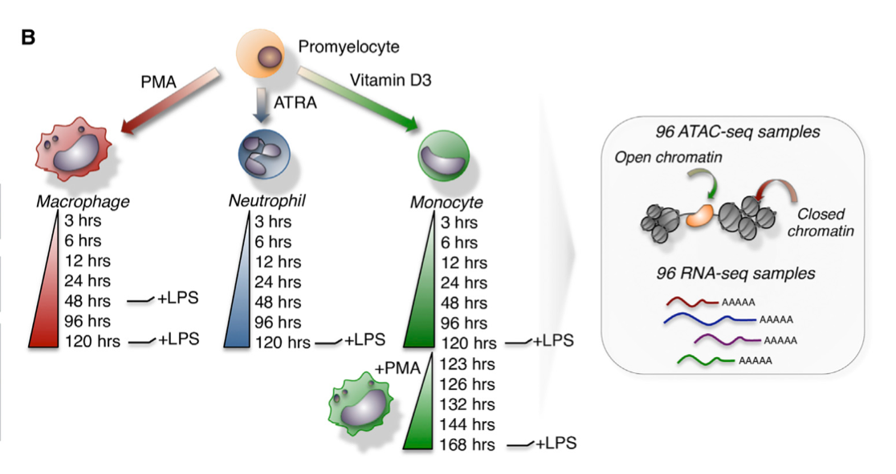

  
```{r, include=FALSE}

knitr::opts_chunk$set(echo = TRUE)
set.seed(12345)

```

## Human Myeloid Differentiation based on Monocytes

Dataset RNA-seq: GSE79044
Dataset ATAC-seq: GSE79019
Purpose: Identify differences in chromatin regions profiles in monocytes at 3 time points of differentiation: 3h, 6h, 12h. Investigate if the RNA-seq expression data follows the same trend corresponding to differential peaks.

Paper: Ramirez RN, El-Ali NC, Mager MA, Wyman D, Conesa A, Mortazavi A. Dynamic Gene Regulatory Networks of Human Myeloid Differentiation. Cell Syst. 2017 Apr 26;4(4):416-429.e3. doi: 10.1016/j.cels.2017.03.005. Epub 2017 Mar 29. PMID: 28365152; PMCID: PMC5490374


### Load the data 

```{r, message=FALSE, warning=FALSE}
####################
# FROM GEO samples #
####################
# set up
rm(list = ls())
library(rtracklayer) #reading genomic info 
library(GenomicRanges) #intervals of regions

setwd("/Users/kurowsaa/OneDrive/Documents/KAUST/Bioinfo_pipelines_course/WEEK_3/")

# control panel
raw_data_folder <- 'GSE79019_RAW'
min_overlap <- 0.3 #min overlap - 3bp for both peaks for replicates of each timepoint, we can be strict with the threshold here, as we expect the biological replicates from the same time point to have aligned signal
chromosomes <- paste0('chr', c(1:22, 'X', 'Y')) #keep only known and defined chromosomes

# bed files 
bed_files <- file.path(raw_data_folder, 
                       dir(raw_data_folder, pattern = '*.bed'))


```


### Find consensus peaks for each time point independently, by merging the replicates of each time point
It is important to find consensus peaks separately for each timepoint of the differentiation, to provide unique input for differential expression analysis. 

```{r, message=FALSE, warning=FALSE}

# Select bed files of replicates for each time point
mono_3h <- bed_files[1:3]
mono_6h <- bed_files[4:6]
mono_12h <- bed_files[7:9]

bed_list <- list(mono_3h, mono_6h, mono_12h)

consensus <- list()
for(i in 1:length(bed_list)){
  #import bed files
  bed_1 <- import(bed_list[[i]][1])
  bed_2 <- import(bed_list[[i]][2])
  bed_3 <- import(bed_list[[i]][3])

  #Select only chosen chromosomes
  bed_1 <- bed_1[seqnames(bed_1) %in% chromosomes]
  seqlevels(bed_1) <- chromosomes 
  bed_2 <- bed_2[seqnames(bed_2) %in% chromosomes]
  seqlevels(bed_2) <- chromosomes 
  bed_2 <- bed_2[seqnames(bed_2) %in% chromosomes]
  seqlevels(bed_2) <- chromosomes 
  
  #Ready files for consensus peaks
  files <- list(bed_1, bed_2, bed_3)

  for(j in 1:(length(files)-1)){
    # finding overlap between reference_bed and another bed file 
    reference_bed <- files[[1]]
    which_file <- j+1
    new_bed <- files[[which_file]]
    hits <- findOverlaps(reference_bed, new_bed)
    # quantify the overlap
    overlaps <- pintersect(reference_bed[queryHits(hits)], new_bed[subjectHits(hits)])
    # overlap fraction with respect to the original peaks
    percent_overlap_on_1 <- width(overlaps) / width(reference_bed[queryHits(hits)])
    percent_overlap_on_2 <- width(overlaps) / width(new_bed[subjectHits(hits)])
    hits <- hits[percent_overlap_on_1 > min_overlap & 
                 percent_overlap_on_2 > min_overlap]
    # subsetting the bed files
    reference_bed <- reference_bed[queryHits(hits)]
    new_bed <- new_bed[subjectHits(hits)]
    # "reducing" the peaks
    start_1 <- start(reference_bed)
    end_1 <- end(reference_bed)
    start_2 <- start(new_bed)
    end_2 <- end(new_bed)
    reduced_start <- pmin(start_1, start_2)
    reduced_end <- pmax(end_1, end_2)
    new_reference_bed <- reference_bed
    start(new_reference_bed) <- reduced_start
    end(new_reference_bed) <- reduced_end
    files[[1]] <- new_reference_bed
    print(length(files[[1]]))
  }
  
  # Save consensus peaks of each time point by removing duplicated regions
  consensus[[i]] <- reduce(files[[1]])
}


names(consensus) <- c("consens_3h", "consens_6h", "consens_12h")


```


### Merge consensus peaks from all of the time points (unique + duplicated)

```{r, message=FALSE, warning=FALSE}

# Inpsect 
summary(consensus)
#            Length Class   Mode
#consens_3h  7200   GRanges S4  
#consens_6h  9660   GRanges S4  
#consens_12h 8469   GRanges S4 

# On average we get ~8.4k consensus peaks for each time point from the replicates, 

# peak union!
union_reference_bed <- c(consensus[[1]], consensus[[2]], consensus[[3]]) #25329 peaks from 3 timepoints
length(union_reference_bed)

# FINAL CONSENSUS: Select all peaks (common and unique) and merge peaks closer than 30bp

library(GenomicRanges)
library(ChIPpeakAnno)
library(limma)

peak_overlap <- findOverlapsOfPeaks(consensus[[1]], consensus[[2]], consensus[[3]], maxgap = 31, connectedPeaks = "merge")

# Plot venn diagram of overlaps
vennDiagram(peak_overlap$venn_cnt, names = c("mono_3h","mono_6h", "mono_12h"), circle.col = c("pink","red","purple"))
            
# We have 4668 common peaks shared between all 3 time points 
# 1168 peaks shared between 3h and 6h 
# 1603 peaks shared between 6h and 12h 
# 446 peaks shared between 3h adn 12h 
# 895 unique peaks for 3h
# 2187 unique peaks for 6h
# 1725 unique peaks for 12h
            
peak_overlap <- peak_overlap$peaklist
length(peak_overlap)
peak_overlap <- c(peak_overlap[[1]], peak_overlap[[2]], peak_overlap[[3]], peak_overlap[[4]],
                peak_overlap[[5]], peak_overlap[[6]], peak_overlap[[7]])

peak_overlap <- sort(peak_overlap)
summary(peak_overlap)
#"GRanges object with 12691 ranges and 1 metadata column"

```

### Clean peaks

```{r, message=FALSE, warning=FALSE}
# loading black listed regions - repetitive motives 
# https://www.encodeproject.org/annotations/ENCSR636HFF/
black_listed_bed <- import('ENCFF356LFX.bed')

# any hit?
hits <- findOverlaps(peak_overlap, black_listed_bed)
hits #143

# what about the length of the overlap?
overlaps <- pintersect(peak_overlap[queryHits(hits)], 
                       black_listed_bed[subjectHits(hits)])
summary(width(overlaps)/width(peak_overlap[queryHits(hits)]))

# eliminating the blacklisted regions
union_reference_bed <- peak_overlap[-queryHits(hits)]

# Name peaks
head(union_reference_bed)
consensus <- as.data.frame(union_reference_bed)
consensus <- consensus[,1:3]
consensus[,4] <- paste0("ConsensusPeak_", 1:nrow(consensus))
consensus[,5] <- 0
consensus[,6] <- "."

# writing the reference
export.bed(consensus, con = 'reference.bed')

# We get at the end 12551 merged peaks between 3 time points

```

### Generate counts matrix

```{r, message=FALSE, warning=FALSE}
# control panel
raw_data_folder <- 'GSE79019_RAW'
read_length <- 36
chromosomes <- paste0('chr', c(1:22, 'X', 'Y'))
reference_file <- 'reference.bed'

# bw files
bw_files <- file.path(raw_data_folder, dir(raw_data_folder, pattern = '*.bw'))

# loading reference bed
peaks <- import(reference_file)

# count matrix
count_matrix <- matrix(0, length(peaks), length(bw_files))
rownames(count_matrix) <- paste0(seqnames(peaks), '_', start(peaks), '_', end(peaks))
colnames(count_matrix) <- letters[1:length(bw_files)]

# looping over files
for(i in 1:length(bw_files)){
  
  # current files
  print(paste0('sample ', i, ' out of ', length(bw_files)))
  bw_file <- bw_files[i]
  
  # sample name
  sample_name <- gsub(raw_data_folder, '', bw_file, fixed = TRUE)
  sample_name <- gsub('.bw', '', sample_name, fixed = TRUE)
  sample_name <- gsub('/', '', sample_name, fixed = TRUE)
  sample_name <- strsplit(sample_name, '_')[[1]][2]
  # if(grepl('HL60', sample_name)){
  #   sample_name <- paste0('T0h-', sample_name)
  # }else{
  #   sample_name <- paste0('T', sample_name) 
  # }
  
  # loadind and downsizing the bigwigfile
  bw_file_list <- BigWigFileList(bw_file)
  coverage <- import(bw_file_list[[1]], as = 'RleList')
  coverage <- coverage[names(coverage) %in% chromosomes]
  
  # split the peaks across chromosomes
  peaks_list <- split(peaks, seqnames(peaks))

  # coverage per peak
  coverage <- coverage[names(peaks_list)]
  peaks_coverage <- Views(coverage, ranges(peaks_list))

  # count values
  counts <- sapply(peaks_coverage, sum)
  
  # ensuring to have the right peak information
  chrs <- rep(names(peaks_coverage), sapply(peaks_coverage, length))
  starts <- sapply(peaks_coverage, start)
  ends <- sapply(peaks_coverage, end)

  # converting to vector
  counts <- unlist(counts)
  names(counts) <- paste0(chrs, '_', unlist(starts), '_', unlist(ends))
  
  # rounding up
  counts <- round(counts / read_length)
  
  # count as data frame
  count_matrix[names(counts), i] <- counts
  colnames(count_matrix)[i] <- sample_name
  
}

# writing
count_matrix <- as.data.frame(count_matrix)
count_matrix <- cbind(peak = rownames(count_matrix), count_matrix) #12551  x  10
head(count_matrix)
write.csv(count_matrix, row.names = FALSE,
          file = 'count_matrix.csv')

```


### Differential expression

```{r, message=FALSE, warning=FALSE}

# set up
rm(list = ls())
library(DESeq2)
library(ggplot2)
library(ChIPseeker)
library(rtracklayer)
library(clusterProfiler)
library(chipenrich)
library(TxDb.Hsapiens.UCSC.hg38.knownGene)
txdb <- TxDb.Hsapiens.UCSC.hg38.knownGene

# control panel
lfc_threshold <- 1
sign_threshold <- 0.05

# load count matrix
count_matrix <- read.csv('count_matrix.csv')
rownames(count_matrix) <- count_matrix$peak
count_matrix$peak <- NULL
head(count_matrix)

colnames(count_matrix) <- gsub("X", "", colnames(count_matrix))

# PCA
metadata <- data.frame(matrix(NA, ncol = 3, nrow = 9))
colnames(metadata) <- c("time", "cell_type", "rep")
row.names(metadata) <- colnames(count_matrix)
data <- strsplit(colnames(count_matrix), split = ".", fixed = T)

for(i in 1:length(data)){
  data[[i]] <- t(as.data.frame(data[[i]]))
}

metadata <- rbind(data[[1]], data[[2]], data[[3]], data[[4]], data[[5]], data[[6]], data[[7]], data[[8]], data[[9]])
colnames(metadata) <- c("time", "cell_type", "rep")
row.names(metadata) <- colnames(count_matrix)

data_DESeq2 <- DESeqDataSetFromMatrix(countData = count_matrix,
                                           colData = metadata,
                                           design = ~ time)
vsd <- vst(data_DESeq2, blind=FALSE)
pca <- plotPCA(vsd, intgroup=c("time"))

pca 

# We can see a huge variance between samples from the same timepoints, espesially at 12h. Which is a bit unexpected as those are biological replplicates.


# Differential analysis
# Filtering peaks with low counts

smallestGroupSize <- 6
keep <- rowSums(counts(data_DESeq2) >= 10) >= smallestGroupSize
table(keep)
#keep
#FALSE  TRUE 
#1313 11238 
data_DESeq2_F <- data_DESeq2[keep,] # 11,238 x 34


# DIFFERENTIAL EXPRESSION

data_DESeq2_F <- DESeq(data_DESeq2_F)
data_res <- results(data_DESeq2_F)

vsd_f <- vst(data_DESeq2_F, blind=FALSE)
pca <- plotPCA(vsd_f, intgroup=c("time"))
pca

# Filtered data looks a bit better, variance is reduced


# Define questions for differential expression

# What are DE regions between 12h and 6h ?
res_12h_vs_6h <- results(data_DESeq2_F, contrast=c("time","12h", "6h"))

# What are DE regions between 6h and 3h ?
res_6h_vs_3h <- results(data_DESeq2_F, contrast=c("time","6h", "3h"))

# What are DE regions between 6h and 3h ?
res_12h_vs_3h <- results(data_DESeq2_F, contrast=c("time","12h", "3h"))

# Find significant genes
res_12h_vs_6h <- res_12h_vs_6h[!is.na(res_12h_vs_6h$padj),]
sig_12h_vs_6h <- res_12h_vs_6h[abs(res_12h_vs_6h$log2FoldChange) > 1 & res_12h_vs_6h$padj < 0.05,]

res_12h_vs_3h <- res_12h_vs_3h[!is.na(res_12h_vs_3h$padj),]
sig_12h_vs_3h <- res_12h_vs_3h[abs(res_12h_vs_3h$log2FoldChange) > 1 & res_12h_vs_3h$padj < 0.05,]

res_6h_vs_3h <- res_6h_vs_3h[!is.na(res_6h_vs_3h$padj),]
sig_6h_vs_3h <- res_6h_vs_3h[abs(res_6h_vs_3h$log2FoldChange) > 1 & res_6h_vs_3h$padj < 0.05,]


```
We get `r nrow(sig_12h_vs_3h)` peaks for comparing samples at 12h and 3h. 
We get `r nrow(sig_12h_vs_6h)` peaks for comparing samples at 12h and 6h. 
We get `r nrow(sig_6h_vs_3h)` peaks for comparing samples at 6h and 3h. 

Such a minimal number of differential peaks, means that epigenetic profile of monocytes didn't change into 12h of differentiation. 

### Visualization 

```{r, message=FALSE, warning=FALSE}

library(EnhancedVolcano)
EnhancedVolcano(res_12h_vs_3h,
                lab = rownames(res_12h_vs_3h),
                x = 'log2FoldChange',
                y = 'pvalue')

# There is only 1 significantly differentiated peak between 12h and 3h
# chr2_3180280_3181387 is downregulated in monocyted at 12h

#### Chipseeker: annotation ####

# loading the reference bed file
peaks <- import('reference.bed')

# creating the peak name
peaks$name <- paste0(seqnames(peaks), '_', start(peaks), '_', end(peaks))

# annotating
peakAnno <- annotatePeak(peaks, tssRegion=c(-3000, 3000),
                         TxDb=txdb, annoDb="org.Hs.eg.db")

# plotting
plotAnnoBar(peakAnno)
plotDistToTSS(peakAnno)
#peaks show usual characteristics for human data, with aprox. 55% of peaks in promoter regions 


# characterize the significant peak
peakAnno@anno[peakAnno@anno$name %in% rownames(sig_12h_vs_3h),] # Disatl Intergenic, annotated with EIPR1 gene


```

### Integration with RNAseq

```{r, message=FALSE, warning=FALSE}

##### Load the data 

# control panel
raw_data_folder <- 'GSE79044_RAW'
# txt files 
txt_files <- file.path(raw_data_folder, 
                       dir(raw_data_folder, pattern = '*.txt'))
txt_files

# Loop through the file numbers
for(i in 1:length(txt_files)) {
  # Construct the file name
  file_name <- txt_files[[i]]
  
  # Read the file
  # Assuming the first row is the header and there's only one column of data
  temp_data <- read.table(file_name)
  
  # If it's the first file, create the data frame
  if(i == 1) {
    expression_data <- temp_data
  } else {
    # If not the first file, bind the new column to the existing data frame
    # Assuming the rows align across all files
    expression_data <- cbind(expression_data, temp_data[,2])
  }
}


colnames(expression_data) <- expression_data[1,]
expression_data <- expression_data[-1,]
rownames(expression_data) <- expression_data[,1]
expression_data <- expression_data[,-1]
rownames(expression_data) <- gsub("\\..*$", "", rownames(expression_data))

# Make sure that RNA and ATAC data have the same annotations
metadata <- as.data.frame(metadata)
colnames(expression_data) <- rownames(metadata)

# Find the gene of interest annoated in peaks - ENSG00000032389 - EIPR1

# Plot gene expression using violin plots
target_gene <- "ENSG00000032389"
gene_name <- "EIPR1"


# Extract the target gene expression and ensure it's numeric
gene_expression <- as.numeric(expression_data[target_gene, ])

# Create a dataframe for plotting
toPlot <- data.frame(
  sample = colnames(expression_data),
  expression = gene_expression
)

# Merge this data with 'metadata' to get the time information for each sample
toPlot <- merge(toPlot, metadata, by.x = "sample", by.y = "row.names")

# Convert 'time' to a factor with specified levels
toPlot$time <- factor(toPlot$time, levels = c("3h", "6h", "12h"))


time <- factor(metadata$time, levels=c("3h","6h", "12h"))
color_time <- c("#7570B3", "#FF7F00", "#E7298A") 

# Plotting
ggplot(toPlot, aes(x = time, y = expression, fill = time)) +
  geom_violin() +
  scale_fill_manual(values = color_time) +
  ggtitle(paste("Expression of", gene_name)) +
  xlab("Time Point") +
  ylab("Expression Level") +
  theme(axis.text.x = element_text(size = 10, angle = 0))


# Repeat plot for ATACseq

# Plot gene expression using violin plots
rownames(sig_12h_vs_3h)
target_peak <- rownames(sig_12h_vs_3h)
peak_name <- rownames(sig_12h_vs_3h)

# Extract the target gene expression and ensure it's numeric
peak_expression <- assay(vsd_f)[peak_name,]

# Create a dataframe for plotting
toPlot <- data.frame(
  sample = colnames(count_matrix),
  expression = peak_expression
)

# Merge this data with 'metadata' to get the time information for each sample
toPlot <- merge(toPlot, metadata, by.x = "sample", by.y = "row.names")

# Convert 'time' to a factor with specified levels
toPlot$time <- factor(toPlot$time, levels = c("3h", "6h", "12h"))

# Plotting
ggplot(toPlot, aes(x = time, y = expression, fill = time)) +
  geom_violin() +
  scale_fill_manual(values = color_time) +
  ggtitle(paste("Accessibility of", peak_name)) +
  xlab("Time Point") +
  ylab("Expression Level") +
  theme(axis.text.x = element_text(size = 10, angle = 0))


```

The peak is down-regulated with the time from 3h to 12h. We can see a similar trend in the annotated gene to that region - EIPR1, except a huge varaibility of expression at 3h, which makes it hard to come to any conclusions. 


In general, comapring the first 3 time points of the monocyted differentiation, is not enough to make any conclusions, and we should compare further timepoints. 

### ATACseq heatmap

```{r, message=FALSE, warning=FALSE}

# heatmap
library("pheatmap")

# heatmap annotation
df <- as.data.frame(colData(data_DESeq2_F)[,c("time")])
colnames(df) <- "time"

color_time <- c("#7570B3", "#FF7F00", "#E7298A") 
names(color_time) <- c("3h","6h", "12h")

# Define your own colors
group_df = data.frame(vsd_f$time)
rownames(group_df) <- colnames(vsd_f)
colnames(group_df) <- "time"

annotation_df <- data.frame(GroupColor = color_time[vsd$time])

my_colors <- list(color_time)
names(my_colors) <- "time"

toPlot <- assay(vsd_f)

# Plot
pheatmap(toPlot, cluster_rows=T, show_rownames=F, show_colnames = F,
         cluster_cols=F, annotation_col = group_df,annotation_colors = my_colors,
         labels_row = NULL, fontsize_row = 6)


```

As we can see visually through the heatmap, all peaks have very similar accessibility across different time points. 
